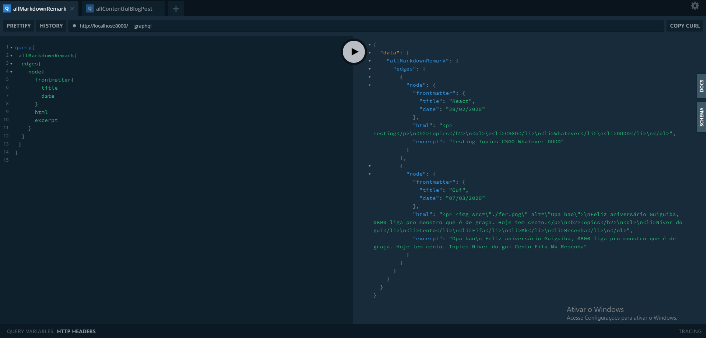

 

   #Informações sobre personalização realizada 

A partir das pesquisas realizadas para a aprimoração do projeto, a construção do blog consiste na utilização de uma ferramenta chamada API “Application Programming Interface“ GRAPHQL PLAYGROUND que é disponibilizada pelo gatsby. Utilizando o GRAPHQL uma considerável quantia de memória pode ser economizada por conta de que os códigos a serem lidos são reduzidos e se apresentam de forma mais limpa.

 

 Com o manuseio em conjunto da API e dos plugins podemos facilmente rastrear, retornar e utilizar os dados de forma responsiva e rápida conforme a foto demonstrada acima. Divididos em subconjuntos usamos estes dados para efetuarmos a criação de por exemplo o blog entry apenas usando a API e plugins, sem a necessidade de usarmos o método "tradicional" que seria criar a página, instanciar uma const, retornar o seu conteúdo e repetir o mesmo processo em todos as consecutivas páginas e posts.
 ## Topics

 1. API
 2. Plugins